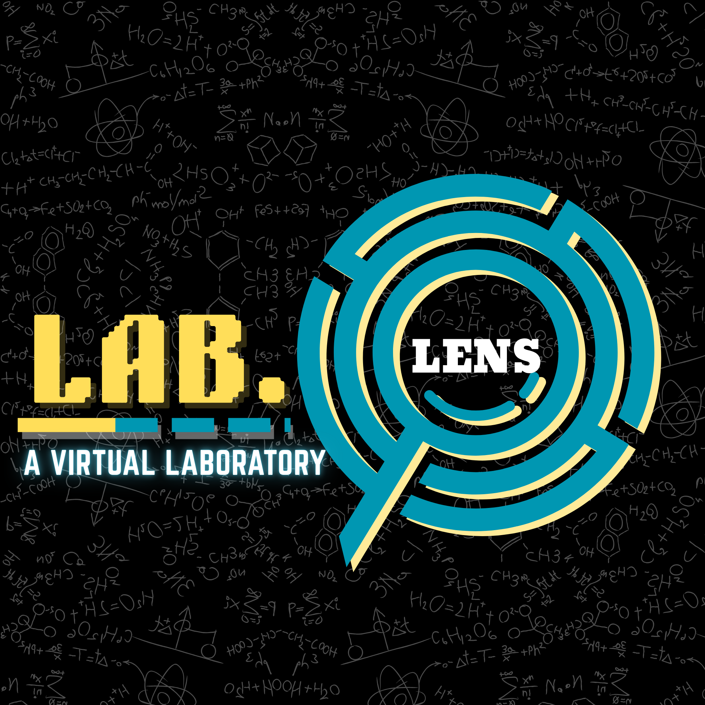

# 🔬 Lab.Lens — Virtual Chemistry Lab

<p align="center">
  
</p>

<p align="center">
  <strong>An interactive virtual chemistry laboratory for titration experiments</strong>
</p>

<p align="center">
  
  
  
  
</p>

---

## 📖 About

**Lab.Lens** is a browser-based virtual chemistry lab that simulates titration experiments with real-time visualization, animated apparatus, and automatic calculations. It's designed for students to practice, visualize, and understand titration processes — including pH-metric, conductometric, and potentiometric titrations — without needing physical lab equipment.

---

## ✨ Features

### 🧪 Three Titration Experiments

| # | Experiment | Type | Reaction |
|---|-----------|------|----------|
| **Exp 5** | pH-Metric Titration | Weak Acid + Strong Base | CH₃COOH + NaOH |
| **Exp 6** | Conductometric Titration | Strong Acid + Strong Base | HCl + NaOH |
| **Exp 8** | Potentiometric Titration | Redox | Fe²⁺ (FAS) + K₂Cr₂O₇ |

### 📊 Interactive Visualization
- **Animated Burette & Beaker** — watch the titrant drip into the beaker with color-changing liquid
- **Live Graphs** — real-time Chart.js plots that update as you add titrant
- **Equivalence Point Detection** — automatic calculation using parabolic peak refinement (pH/mV) or linear regression intersection (conductometric)
- **Derivative Graphs** — ΔE/ΔV and d²E/dV² plots for potentiometric titrations
- **Zoom & Pan** — interactive chart zoom with mouse wheel and touch pinch support

### 🧮 Smart Calculations
- **Henderson-Hasselbalch** — automatic pKa and Ka calculation for pH-metric titrations
- **Normality Equation** — N₁V₁ = N₂V₂ for conductometric and potentiometric strength calculations
- **MathJax Rendering** — beautifully rendered mathematical formulas and derivations

### 📋 Comprehensive Info Tabs
- **Info** — aim, chemicals, apparatus, step-by-step procedure, and reference images with lightbox viewer
- **Perform** — interactive simulation with controls, observation table, and live mini-graph
- **Graph** — full-size graph with equivalence point annotations, best-fit lines, buffer region shading, and tangent lines
- **Formulas** — step-by-step derivation of key equations with animated timeline

### 📤 Data Export
- **CSV Export** — download observation data as a CSV file
- **Graph PNG** — save the graph as a high-resolution image
- **Print Report** — print a formatted lab report

### ✏️ Custom Observations Mode
- Enter your own lab data to visualize custom graphs
- Step-by-step data entry wizard
- Works with all three experiment types

---

## 🚀 Getting Started

### Prerequisites
- A modern web browser (Chrome, Firefox, Safari, Edge)
- No installation or server required — it's a static web app!

### Run Locally

1. **Clone the repository**
   ```bash
   git clone https://github.com/77-SIDD-77/Lab.Lens-Chemistry.git
   cd Lab.Lens-Chemistry
   ```

2. **Open in browser**
   
   Simply open `index.html` in your browser, or use a local server:
   ```bash
   # Using Python
   python3 -m http.server 8000
   
   # Using Node.js
   npx serve .
   ```

3. **Start experimenting!**
   
   Select an experiment from the sidebar and begin adding titrant.

---

## 📁 Project Structure

```
Lab.Lens-Chemistry/
├── index.html              # Main application page
├── css/
│   └── style.css           # Complete stylesheet (2200+ lines)
├── js/
│   ├── app.js              # Core application logic, experiment data, simulation engine
│   └── graph.js            # Chart.js graph rendering, plugins, derivative graphs
├── material/
│   ├── logo.png            # Lab.Lens logo
│   ├── exp-5.*.jpeg        # pH-Metric titration reference images
│   ├── exp-6.*.jpeg        # Conductometric titration reference images
│   └── exp-8.*.jpeg        # Potentiometric titration reference images
└── README.md
```

---

## 🛠️ Tech Stack

| Technology | Purpose |
|-----------|---------|
| **HTML5** | Semantic structure with SVG beaker animation |
| **CSS3** | Custom design system with CSS variables, animations, responsive layout |
| **Vanilla JavaScript** | Application logic, simulation engine, DOM manipulation |
| **[Chart.js 4](https://www.chartjs.org/)** | Interactive graphs with custom plugins |
| **[Chart.js Zoom Plugin](https://www.chartjs.org/chartjs-plugin-zoom/)** | Pan & zoom on charts |
| **[Hammer.js](https://hammerjs.github.io/)** | Touch gesture support for chart interactions |
| **[MathJax 3](https://www.mathjax.org/)** | LaTeX formula rendering |
| **[Google Fonts (Inter)](https://fonts.google.com/specimen/Inter)** | Typography |

---

## 📸 Screenshots

### Welcome Screen
> A split-layout landing page with a floating logo animation and experiment categories.

### Perform Tab
> Animated burette and beaker with live observation table and mini-graph.

### Graph Tab
> Full interactive graph with equivalence point annotation, best-fit lines, and derivative curves.

### Formulas Tab
> Step-by-step derivation with MathJax-rendered equations and animated timeline.

---

## 🔬 How It Works

1. **Select an Experiment** from the sidebar
2. **Choose Mode** — use default pre-loaded data or enter your own observations
3. **Read the Info** tab for aim, procedure, and reference materials
4. **Perform the Titration** — add titrant in increments and watch the readings update
5. **View the Graph** — see the titration curve with automatic equivalence point detection
6. **Check Formulas** — understand the underlying chemistry with step-by-step derivations
7. **Export Results** — download CSV data or save graph images

---

## 🤝 Contributing

Contributions are welcome! Feel free to:

1. Fork the repository
2. Create a feature branch (`git checkout -b feature/new-experiment`)
3. Commit your changes (`git commit -m 'Add new experiment'`)
4. Push to the branch (`git push origin feature/new-experiment`)
5. Open a Pull Request

---

## 📄 License

This project is open source and available under the [MIT License](LICENSE).

---

<p align="center">
  Made with ❤️ for Chemistry Students
</p>
